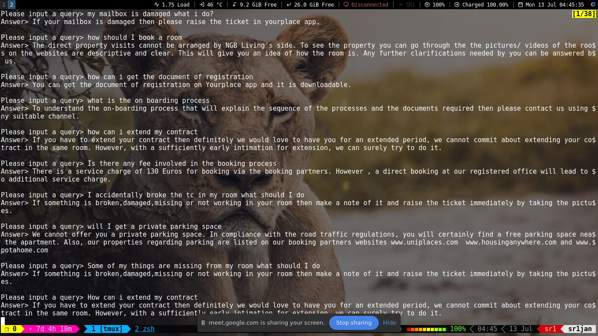
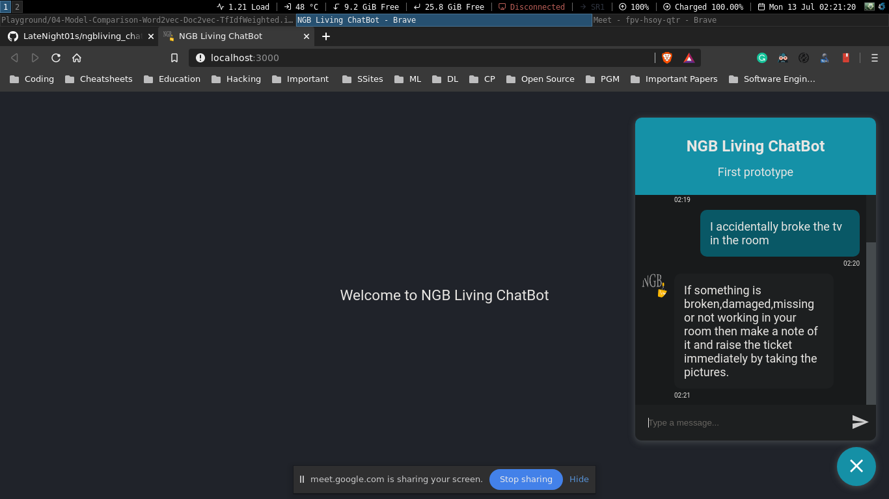

# NGB Living ChatBot

First Prototype:

> Code: [ngb_chatbot.py](https://github.com/LateNight01s/ngbliving_chatbot/blob/master/backend/ngb_chatbot.py) \
> Date: 13/07/2020

## About ChatBots

### Types

- Retrieval-based approach (goal-oriented, narrow, predefined-responses)
- Generative model (chit-chat, general, commonsense)

Generative models are not yet Turing complete, require large amount of data. The SOTA generative models are very large (GPT3-175B, Meena-2.1B) and are for general purpose not for specific domain.

Retrieval-based models are goal-oriented, require domain specific data. There are many approaches involved, i.e, similarity functions with TF-IDF, Dual encoder LSTM, classifier models, Knowledge graphs.

For a website like NGB Living that offers their services to customers, a hybrid approach using both of these two options would work the best.

## Knowledge Graph

KG as the name suggests is a graph based structured data with _entities_ as nodes and their relationship with other entities defined by an edge in the graph.

> **triple**: (Leonard Nimoy, played, Spock), (Spock, character in, Star Trek)

KG can be constructed from unstructured text using various NLP methods like Named Entity Recognition (NER), Keyword Extraction, Sentence Segmentation, etc.

KG are widely used in NLP based system like intelligent chatbots, cognitive search system, QA application, etc. [Google Knowledge Graph](https://en.wikipedia.org/wiki/Knowledge_Graph) is the knowledge base that Google uses to enhance it's search algorithm thats how Google Assistance seems so intelligent.

## Bag of Words

A bag-of-words model, or BoW for short, is a way of extracting features from text for use in modeling, such as with machine learning algorithms.

In this approach, we look at the histogram of the words within the text, i.e. considering each word count as a feature.

## Term Frequency - Inverse Document Frequency (TF-IDF)

It is a numerical statistics which is used in information retrieval process that defines the importance of a word in a document that is part of a collection or corpus.

> Formula

## Cosine Similarity

Cosine similarity is a metric used to measure how similar the documents are irrespective of their size. Mathematically, it measures the cosine of the angle between two vectors projected in a multi-dimensional space.

> Formula

> Example

## Coreference Resolution (coref)

In linguistics, coreference, sometimes written co-reference, occurs when two or more expressions in a text refer to the same person or thing; they have the same referent, e.g. Bill said he would come; the proper noun Bill and the pronoun he refer to the same person, namely to Bill.

## Word Embedding (Word2Vec, GloVe)

Word embedding is the collective name for a set of language modeling and feature learning techniques in natural language processing where words or phrases from the vocabulary are mapped to vectors of real numbers

### References

- [Production Ready Chatbots: Generate if not Retrieve](https://arxiv.org/pdf/1711.09684.pdf)
- [Building a Knowledge Graph-based Dialogue System at the 2nd ConvAI Summer School](https://medium.com/deeppavlov/building-a-knowledge-graph-based-dialogue-system-at-the-2nd-convai-summer-school-ec2d0aa060e5)
- [Document Similarity in Information Retrieval](https://courses.cs.washington.edu/courses/cse573/12sp/lectures/17-ir.pdf)
